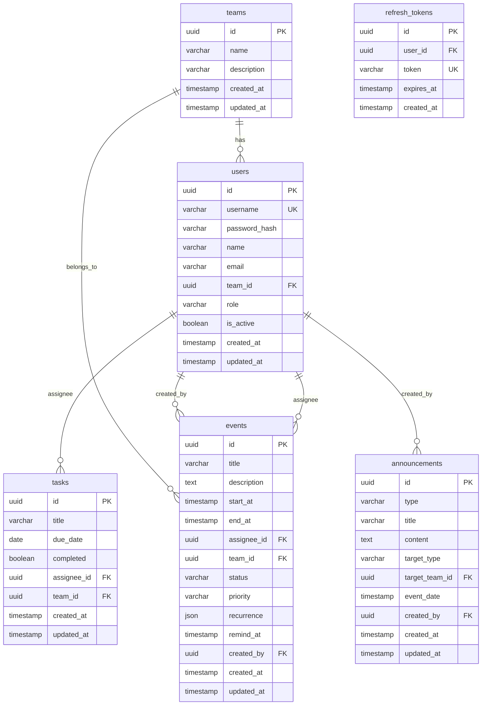

# 업무 관리 시스템 DB 설계

## 1. ERD (개체 관계 다이어그램)

Mermaid 문법으로 표현. GitHub/Notion 등에서 렌더링 가능.



---

## 2. 테이블 정의

### 2.1 teams (팀)

| 컬럼명 | 타입 | NULL | 기본값 | 설명 |
|--------|------|------|--------|------|
| id | UUID | N | gen_random_uuid() | PK |
| name | VARCHAR(100) | N | - | 팀명 |
| description | VARCHAR(500) | Y | - | 설명 |
| created_at | TIMESTAMP | N | now() | 생성일시 |
| updated_at | TIMESTAMP | N | now() | 수정일시 |

**제약**
- PRIMARY KEY (id)
- UNIQUE (name)

**인덱스**
- PK 인덱스 (자동)

---

### 2.2 users (사용자)

| 컬럼명 | 타입 | NULL | 기본값 | 설명 |
|--------|------|------|--------|------|
| id | UUID | N | gen_random_uuid() | PK |
| username | VARCHAR(255) | N | - | 로그인 아이디 (이메일 또는 사번) |
| password_hash | VARCHAR(255) | N | - | bcrypt 등 해시 |
| name | VARCHAR(100) | N | - | 이름 |
| email | VARCHAR(255) | Y | - | 이메일 |
| team_id | UUID | Y | - | 소속 팀 FK (대표는 NULL 가능) |
| role | VARCHAR(20) | N | 'member' | admin / member |
| is_active | BOOLEAN | N | true | 계정 활성 여부 |
| created_at | TIMESTAMP | N | now() | 생성일시 |
| updated_at | TIMESTAMP | N | now() | 수정일시 |

**제약**
- PRIMARY KEY (id)
- UNIQUE (username)
- FOREIGN KEY (team_id) REFERENCES teams(id) ON DELETE SET NULL

**인덱스**
- UNIQUE (username)
- INDEX idx_users_team_id (team_id)
- INDEX idx_users_role (role)
- INDEX idx_users_is_active (is_active)

---

### 2.3 events (일정/업무)

| 컬럼명 | 타입 | NULL | 기본값 | 설명 |
|--------|------|------|--------|------|
| id | UUID | N | gen_random_uuid() | PK |
| title | VARCHAR(200) | N | - | 제목 |
| description | TEXT | Y | - | 설명 |
| start_at | TIMESTAMP | N | - | 시작 일시 |
| end_at | TIMESTAMP | N | - | 종료 일시 |
| assignee_id | UUID | N | - | 담당자 FK |
| team_id | UUID | N | - | 팀 FK |
| status | VARCHAR(20) | N | 'scheduled' | scheduled / in_progress / completed / on_hold |
| priority | VARCHAR(20) | N | 'normal' | low / normal / high |
| recurrence | JSONB | Y | - | 반복 규칙 { "type": "weekly", "interval": 1, "until": "..." } |
| remind_at | TIMESTAMP | Y | - | 알림 일시 |
| created_by | UUID | N | - | 생성자 FK |
| created_at | TIMESTAMP | N | now() | 생성일시 |
| updated_at | TIMESTAMP | N | now() | 수정일시 |

**제약**
- PRIMARY KEY (id)
- FOREIGN KEY (assignee_id) REFERENCES users(id) ON DELETE CASCADE
- FOREIGN KEY (team_id) REFERENCES teams(id) ON DELETE CASCADE
- FOREIGN KEY (created_by) REFERENCES users(id) ON DELETE SET NULL
- CHECK (end_at >= start_at)

**인덱스**
- INDEX idx_events_assignee_id (assignee_id)
- INDEX idx_events_team_id (team_id)
- INDEX idx_events_start_end (start_at, end_at)  — 캘린더 기간 조회용
- INDEX idx_events_start_at (start_at)

---

### 2.4 tasks (할 일 — 일과 체크리스트)

| 컬럼명 | 타입 | NULL | 기본값 | 설명 |
|--------|------|------|--------|------|
| id | UUID | N | gen_random_uuid() | PK |
| title | VARCHAR(200) | N | - | 제목 |
| due_date | DATE | N | - | 마감일 |
| completed | BOOLEAN | N | false | 완료 여부 |
| assignee_id | UUID | N | - | 담당자 FK |
| team_id | UUID | N | - | 팀 FK (담당자 팀과 동기화) |
| created_at | TIMESTAMP | N | now() | 생성일시 |
| updated_at | TIMESTAMP | N | now() | 수정일시 |

**제약**
- PRIMARY KEY (id)
- FOREIGN KEY (assignee_id) REFERENCES users(id) ON DELETE CASCADE
- FOREIGN KEY (team_id) REFERENCES teams(id) ON DELETE CASCADE

**인덱스**
- INDEX idx_tasks_assignee_due (assignee_id, due_date)
- INDEX idx_tasks_due_date (due_date)
- INDEX idx_tasks_completed (completed)

---

**공지/회사일정**: `events` 테이블에는 개인·팀 업무만 저장. 공지/회사일정은 `announcements` 테이블만 사용하며, `GET /events` API에서 조회 기간에 맞는 공지(`event_date` 기준)를 가져와 응답에 합쳐서 반환.

---

### 2.5 announcements (공지 / 회사 일정)

| 컬럼명 | 타입 | NULL | 기본값 | 설명 |
|--------|------|------|--------|------|
| id | UUID | N | gen_random_uuid() | PK |
| type | VARCHAR(30) | N | - | notice / company_event |
| title | VARCHAR(200) | N | - | 제목 |
| content | TEXT | Y | - | 내용 |
| target_type | VARCHAR(20) | N | 'all' | all / team |
| target_team_id | UUID | Y | - | 대상 팀 (target_type=team일 때) |
| event_date | TIMESTAMP | Y | - | 회사 일정일 때 표시 일시 |
| created_by | UUID | N | - | 등록자 FK |
| created_at | TIMESTAMP | N | now() | 생성일시 |
| updated_at | TIMESTAMP | N | now() | 수정일시 |

**제약**
- PRIMARY KEY (id)
- FOREIGN KEY (target_team_id) REFERENCES teams(id) ON DELETE SET NULL
- FOREIGN KEY (created_by) REFERENCES users(id) ON DELETE SET NULL
- CHECK (target_type IN ('all', 'team'))

**인덱스**
- INDEX idx_announcements_event_date (event_date)
- INDEX idx_announcements_target (target_type, target_team_id)
- INDEX idx_announcements_created_at (created_at)

---

### 2.6 refresh_tokens (토큰 갱신용, 선택)

| 컬럼명 | 타입 | NULL | 기본값 | 설명 |
|--------|------|------|--------|------|
| id | UUID | N | gen_random_uuid() | PK |
| user_id | UUID | N | - | 사용자 FK |
| token | VARCHAR(500) | N | - | 리프레시 토큰 |
| expires_at | TIMESTAMP | N | - | 만료 일시 |
| created_at | TIMESTAMP | N | now() | 생성일시 |

**제약**
- PRIMARY KEY (id)
- FOREIGN KEY (user_id) REFERENCES users(id) ON DELETE CASCADE
- UNIQUE (token)

**인덱스**
- INDEX idx_refresh_tokens_user_id (user_id)
- INDEX idx_refresh_tokens_expires_at (expires_at) — 만료된 토큰 정리용

---

## 3. 반복 일정 (recurrence) JSON 스키마 예시

**events.recurrence** 예시:

```json
{
  "type": "weekly",
  "interval": 1,
  "weekdays": [1, 3, 5],
  "until": "2025-12-31T23:59:59.000Z"
}
```

| 필드 | 타입 | 설명 |
|------|------|------|
| type | string | daily / weekly / monthly |
| interval | number | 간격 (1=매일, 2=2일마다 등) |
| weekdays | number[] | 0=일~6=토 (weekly일 때) |
| monthDay | number | 1–31 (monthly일 때) |
| until | string (ISO) | 반복 종료일시 |

---

## 4. 상태/코드 값 정의

### events.status
| 값 | 설명 |
|----|------|
| scheduled | 예정 |
| in_progress | 진행중 |
| completed | 완료 |
| on_hold | 보류 |

### events.priority
| 값 | 설명 |
|----|------|
| low | 낮음 |
| normal | 보통 |
| high | 높음 |

### users.role
| 값 | 설명 |
|----|------|
| admin | 대표(관리자) |
| member | 팀원 |

### announcements.type
| 값 | 설명 |
|----|------|
| notice | 공지 |
| company_event | 회사 일정 (휴무, 회의 등) |

### announcements.target_type
| 값 | 설명 |
|----|------|
| all | 전체 |
| team | 특정 팀 |

---

## 5. 캘린더 조회 쿼리 최적화

### 일정 기간 조회 (GET /events?start=&end=)

- **조건**: `start_at < :end AND end_at > :start` (기간 겹치는 일정)
- **인덱스**: `(start_at, end_at)` 또는 `(assignee_id, start_at)` (담당자 필터 시)
- 대표: team_id, assignee_id 필터 적용
- 팀원: assignee_id = 현재 사용자

### 일과(할 일) 조회 (GET /tasks?date=)

- **조건**: `due_date = :date`, 필요 시 `assignee_id = :userId`
- **인덱스**: `(assignee_id, due_date)` 로 커버링 가능

---

## 6. 초기 데이터 (시드)

1. **teams**: 마케팅팀, PM(기획)팀, CS팀, 디자인팀
2. **users**: 대표 계정 1명 (role=admin, team_id=NULL 또는 특정 팀)
3. 필요 시 테스트용 팀원 계정 1~2명

---

## 7. 마이그레이션 순서

1. `teams` 생성
2. `users` 생성 (team_id FK)
3. `events` 생성 (assignee_id, team_id, created_by FK)
4. `tasks` 생성 (assignee_id, team_id FK)
5. `announcements` 생성 (target_team_id, created_by FK)
6. `refresh_tokens` 생성 (user_id FK)
7. 인덱스 추가
8. 시드 데이터 삽입

---

## 8. ERD 요약 (텍스트)

```
teams (1) ----< (N) users      [팀 : 소속 사용자]
users (1) ----< (N) events     [담당자 : 일정]
users (1) ----< (N) events    [생성자 : 일정]
teams (1) ----< (N) events    [팀 : 일정]
users (1) ----< (N) tasks     [담당자 : 할 일]
teams (1) ----< (N) tasks     [팀 : 할 일]
users (1) ----< (N) announcements [등록자 : 공지]
teams (1) ----< (N) announcements [대상 팀 : 공지, optional]
users (1) ----< (N) refresh_tokens [사용자 : 리프레시 토큰]
```

이 설계를 바탕으로 PostgreSQL/MySQL 등에서 DDL 생성 및 ORM 모델로 매핑하면 됩니다.
